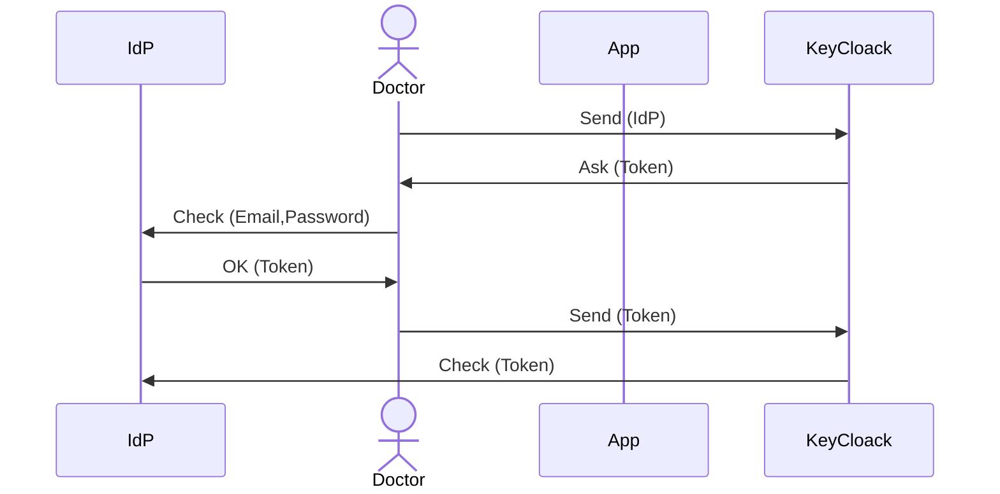

# Authentication and Access Control

## Authentication with KeyCloak

### Signup without IdP


sequenceDiagram
    actor Doctor
    participant App
    participant API
    participant KeyCloack
    actor Admin
    Doctor->>KeyCloack: Send (Email,Password)
    KeyCloack->>Doctor: OK
    KeyCloack-->>KeyCloack: Store
    Admin->>KeyCloack: Add capabilities


### Signup with IdP

### Login

### Reset Pass

## Access Control

### Lookup Tables

|              | Doctor | Monitor | Tech |
| ------------ | ------ | ------- | ---- |
| Patient      | ✅      | ❌       | ❌    |
| Installation | ✅      | ❌       | ✅    |
| Stream       | ✅      | ✅       | ❌    |

### Other Tables

|                | Doctor | Monitor | Tech |
| -------------- | ------ | ------- | ---- |
| PatientGeneral | ✅      | ❌       | ✅    |
| PatientDetail  | ✅      | ❌       | ❌    |
| SensitiveData  | ⭕      | ✅       | ❌    |
| Ticket         | ✅      | ✅       | ✅    |
