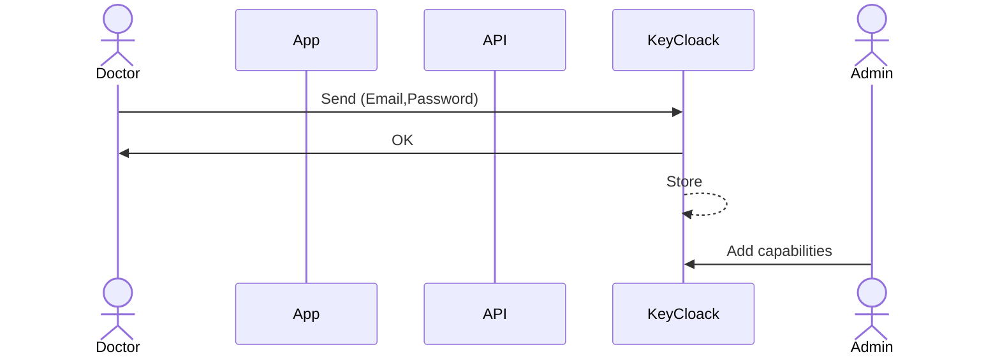
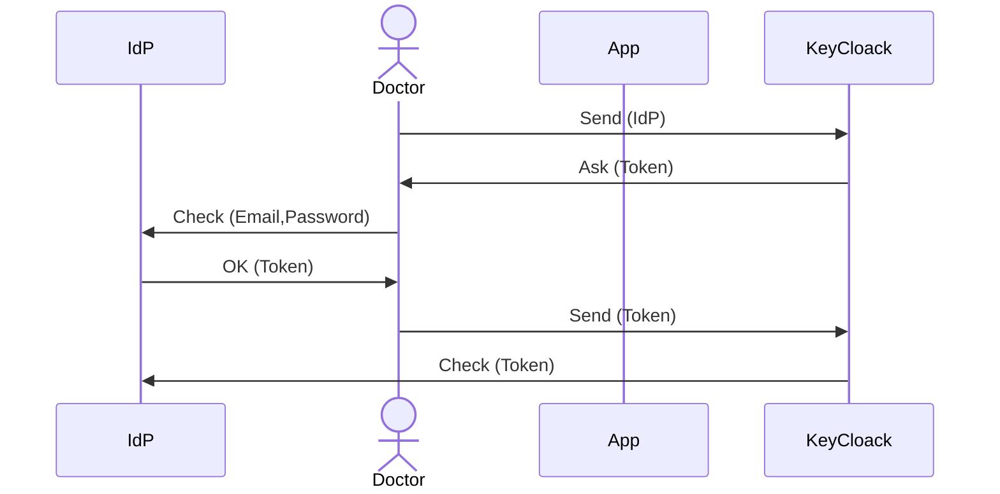
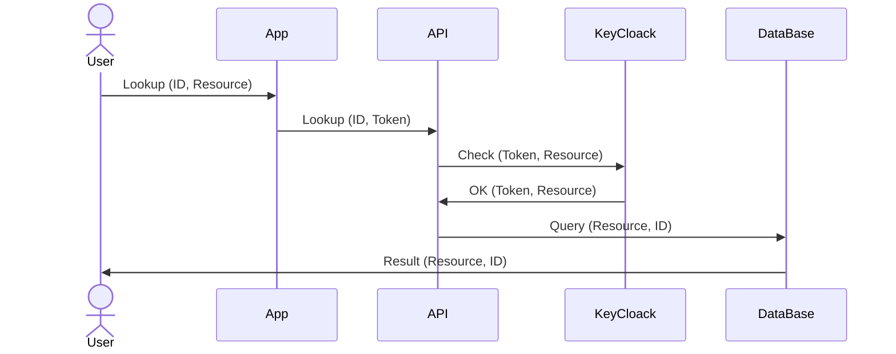
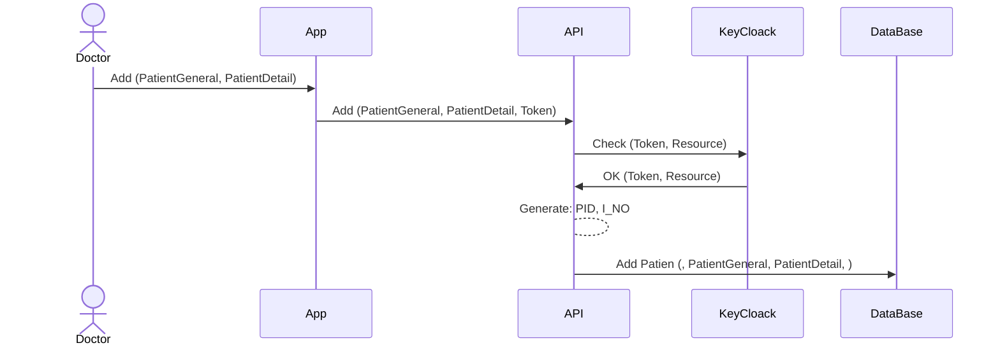

# Authentication and Access Control

## Table Access

### V0 - Tables

|                | Doctor | Monitor | Tech |
| -------------- | ------ | ------- | ---- |
| Patient        | ✅      | ✅       | ❌    |
| PatientGeneral | ✅      | ❌       | ✅    |
| PatientDetail  | ✅      | ❌       | ❌    |
| Ticket         | ⭕      | ✅       | ✅    |
| SensitiveData  | ⭕      | ✅       | ❌    |

<!-- Users of `monitor` group need to access `Patient` table to know, but `I_NO` is not a col -->

### V2 - Lookup Tables

|              | Doctor | Monitor | Tech |
| ------------ | ------ | ------- | ---- |
| Patient      | ✅      | ❌       | ❌    |
| Installation | ✅      | ❌       | ✅    |
| Stream       | ✅      | ✅       | ❌    |

### V2 -Other Tables

|                | Doctor | Monitor | Tech |
| -------------- | ------ | ------- | ---- |
| PatientGeneral | ✅      | ❌       | ✅    |
| PatientDetail  | ✅      | ❌       | ❌    |
| Ticket         | ⭕      | ✅       | ✅    |
| SensitiveData  | ⭕      | ✅       | ❌    |

## Authentication with KeyCloak

### Signup without IdP

### Signup with IdP

### Login

### Reset Password

## Access Control

### Remote Lookup

### Local Lookup

### Add `Patient`

