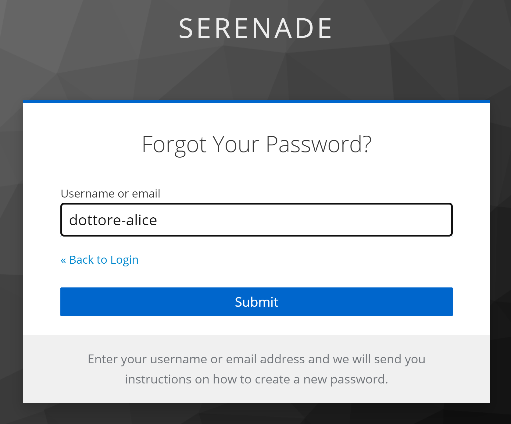

# Authentication and Access Control

## Table Access

We specify for each user group which table can be accessed.

- ✅ is granted
- ❌ is not granted
- ⭕ grant it's not needed

See [here](../model/) to review the logical model of tables.

### `V0` - All Tables

| | Doctor | Monitor | Tech |
| - | - | - | - |
| Patient | ✅ | ✅ | ❌ |
| PatientGeneral | ✅ | ❌ | ✅ |
| PatientDetail  | ✅ | ❌ | ❌ |
| Ticket | ⭕ | ✅ | ✅ |
| SensitiveData  | ⭕ | ✅ | ❌ |

### `V2` - Lookup Tables

| | Doctor | Monitor | Tech |
| - | - | - | - |
| Patient | ✅ | ❌ | ❌ |
| Installation | ✅ | ❌ | ✅ |
| Stream | ✅ | ✅ | ❌ |

### `V2` -Other Tables

| | Doctor | Monitor | Tech |
| - | - | - | - |
| PatientGeneral | ✅ | ❌ | ✅ |
| PatientDetail  | ✅ | ❌ | ❌ |
| Ticket | ⭕ | ✅ | ✅ |
| SensitiveData  | ⭕ | ✅ | ❌ |

## Authentication with Keycloak

Users can register or manage their accounts from `keycloack.domain/realms/serenade/account/`.

### Signup without IdP

#### User signup

#### Admin actions

### Signup with IdP

### Login

#### 

#### 

#### 

#### Forgot Password

 

## Access Control

### Grant Actions

Any action over the `Database` must be granted by `Keycloak`.
We can generalize all actions like the following sequence diagram:

Where `ResourceAction` can be:

- A `Lookup` query on an `ID` or `Nick`
- `Get` an existing `Patient` or `Ticket`
- `Post` a new `Patient` or `Ticket`
- `Pull` an update for a `Patient` or a `Ticket`
