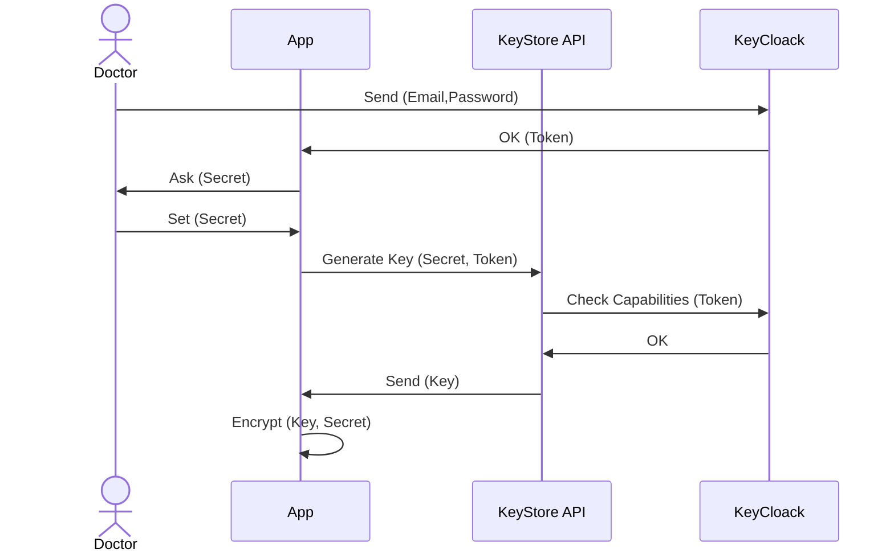
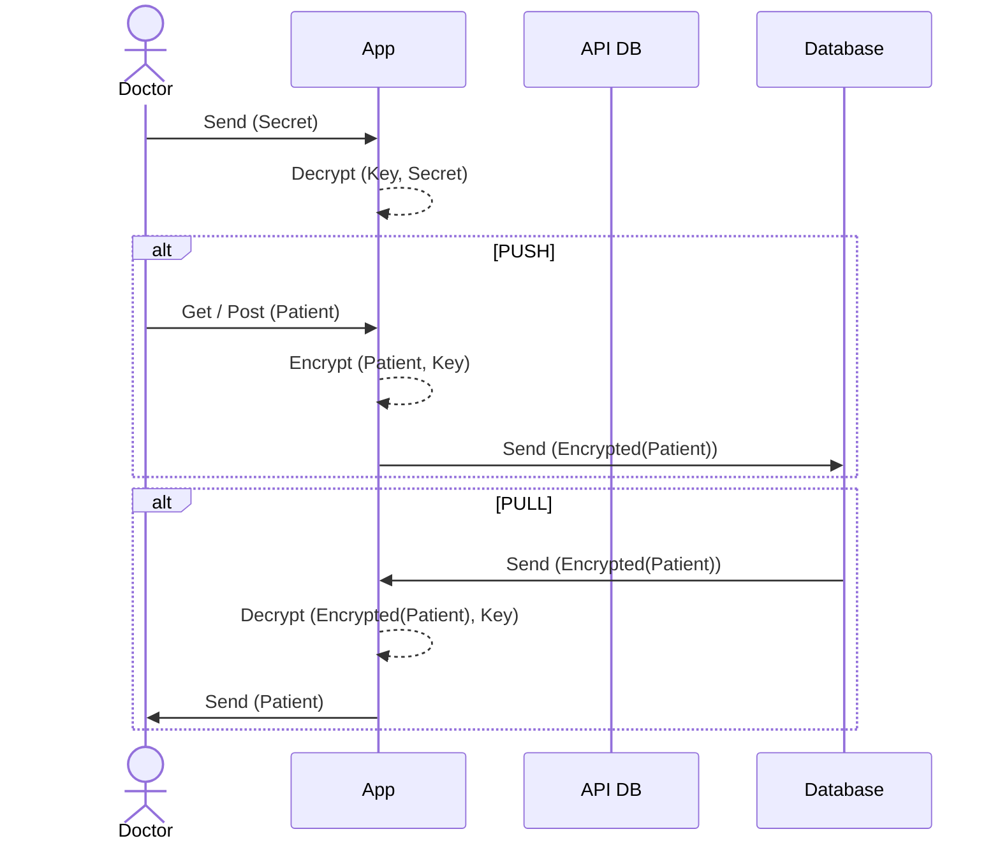

# Encryption

## Server-side

Some DB frameworks (like MariaDB) support fine-grained access control at the table level through the use of roles and permissions. You can assign specific privileges to those roles for particular tables. This allows you to control who performs certain actions on specific tables and log them.

1. **Roles** for different responsibilities in the application.

    ```sql
    CREATE ROLE dottore;
    CREATE ROLE tecnico;
    CREATE ROLE monitor;
    ```

2. **Grant Privileges** to each role for the relevant tables.

    ```sql
    GRANT SELECT, INSERT, UPDATE, DELETE ON PatientDetail TO dottore;
    GRANT SELECT, INSERT ON Ticket TO tecnico;
    GRANT SELECT ON SensitiveData TO monitor;
    ```

3. **Assign Roles** to users:

    ```sql
    GRANT dottore TO dottore-alice;
    GRANT tecnico TO tecnico-bob;
    GRANT monitor TO monitor-charlie;
    ```

Then the dataset can be encrypted using TDE (Transparent Data Encryption) on the server side.

## Client-side

### Login - First Access



`Key` will be used to encrypt data on the client side. `Key` is encrypted with `Secret`

The KeyStore API must be a trusted microservice. It allows to:

1. Don't save `Key` on the client app.
2. Regenerate `Key` when needed (forgot `Secret`, reset client app)

### Pull and Push Data


