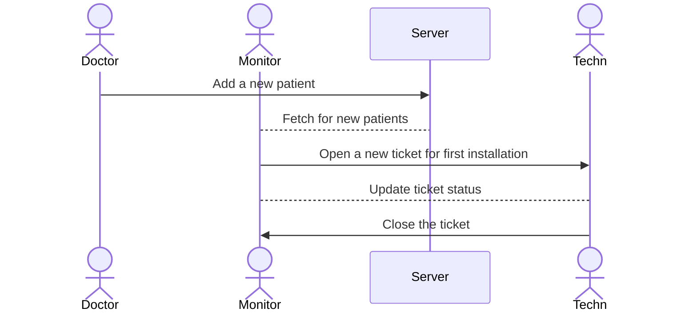
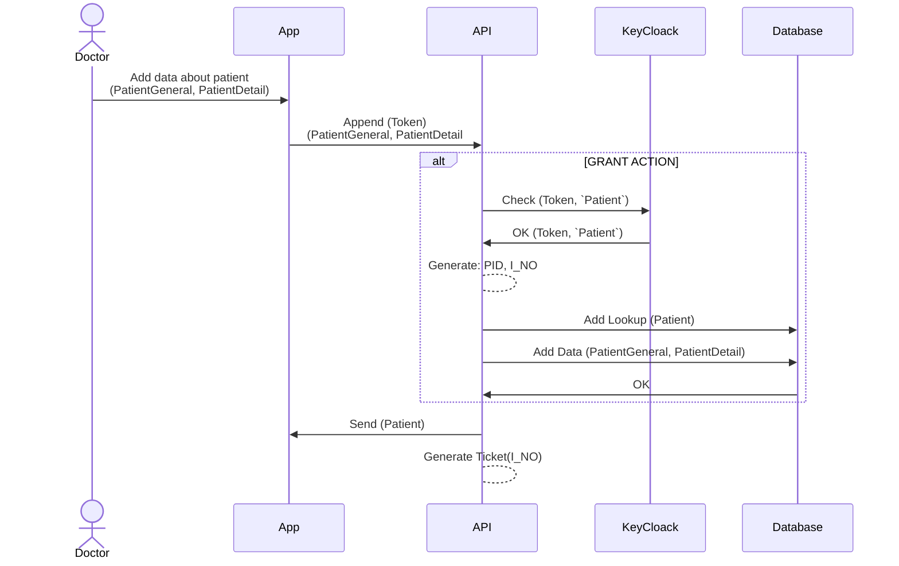
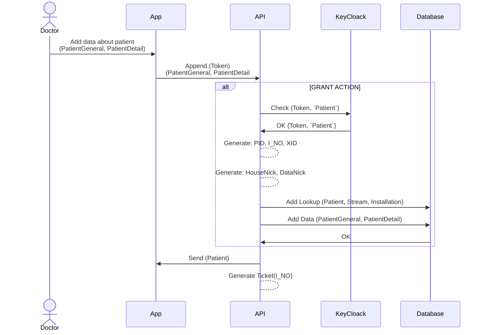
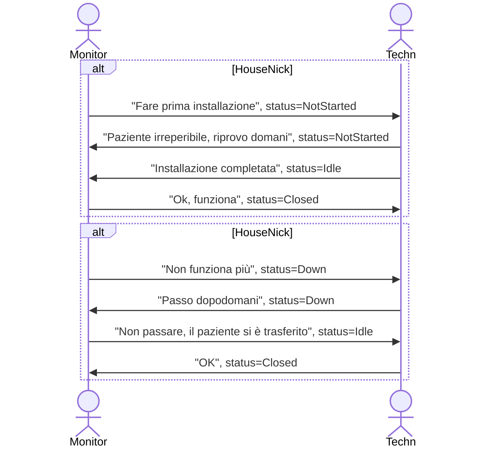

# Flow

## Add a new patient

### Overview

```mermaid
sequenceDiagram
    actor Doctor
    actor Monitor
    participant Server
    actor Techn
    Doctor->>Server: Add a new patient
    %%Server-->Server: Generate a new ticket
    Monitor-->Server: Fetch for new patients
    Monitor->>Techn: Open a new ticket for first installation
    Techn-->Monitor: Update ticket status
    Techn->>Monitor: Close the ticket
```

### `V0` `Post Patient`

```mermaid
sequenceDiagram
    actor Doctor
    Doctor->>App: Add data about patient <br> (PatientGeneral, PatientDetail)
        App->> API: Append (Token) <br> (PatientGeneral, PatientDetail
    alt GRANT ACTION
        API->>KeyCloack: Check (Token, `Patient`)
        KeyCloack->>API: OK (Token, `Patient`)
        API-->API: Generate: PID, I_NO
        API->>Database: Add Lookup (Patient)
        API->>Database: Add Data (PatientGeneral, PatientDetail)
        Database->>API: OK
    end
    API->>App: Send (Patient)
    API-->API: Generate Ticket(I_NO)
```

### `V2` `Post Patient`

```mermaid
sequenceDiagram
    actor Doctor
    Doctor->>App: Add data about patient <br> (PatientGeneral, PatientDetail)
        App->> API: Append (Token) <br> (PatientGeneral, PatientDetail
    alt GRANT ACTION
        API->>KeyCloack: Check (Token, `Patient`)
        KeyCloack->>API: OK (Token, `Patient`)
        API-->API: Generate: PID, I_NO, XID
        API-->API: Generate: HouseNick, DataNick
        API->>Database: Add Lookup (Patient, Stream, Installation)
        API->>Database: Add Data (PatientGeneral, PatientDetail)
        Database->>API: OK
    end
    API->>App: Send (Patient)
    API-->API: Generate Ticket(I_NO)
```

## Example of ticket flow

```mermaid
sequenceDiagram
    actor Monitor
    actor Techn
    alt HouseNick
        Monitor->>Techn: "Fare prima installazione", status=NotStarted
        Techn->>Monitor: "Paziente irreperibile, riprovo domani", status=NotStarted
        Techn->>Monitor: "Installazione completata", status=Idle
        Monitor->>Techn: "Ok, funziona", status=Closed
    end
    
    alt HouseNick
        Monitor->>Techn: "Non funziona più", status=Down
        Techn->>Monitor: "Passo dopodomani", status=Down
        Monitor->>Techn: "Non passare, il paziente si è trasferito", status=Idle
        Techn->>Monitor: "OK", status=Closed
    end
```
