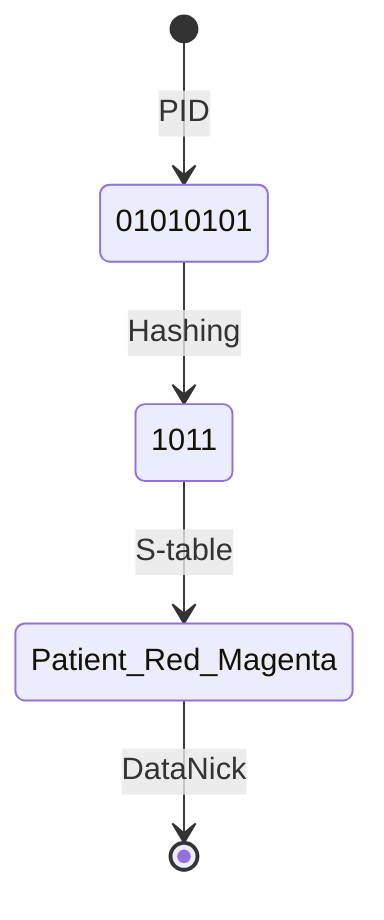

# Alias derivarion

## S-Table Hashing

We can figure `Nick` aliases like an hashing of thier primary keys. Then an `S-table` will bind hashing to representation.
In this scenation we don't need anymore to store any `Nick`  into the data model, `Nick` colud be derived locally.

Let's see example of hashing. Imagine a simple `S-table` like this:

| Byte | Word |
|---|---|
| 00 | Black |
| 01 | Blue |
| 10 | Red |
| 11 | Magenta |

The `Nick` derivation will follow this flow:

## Fiat Shamir

## RSA Lehmer
