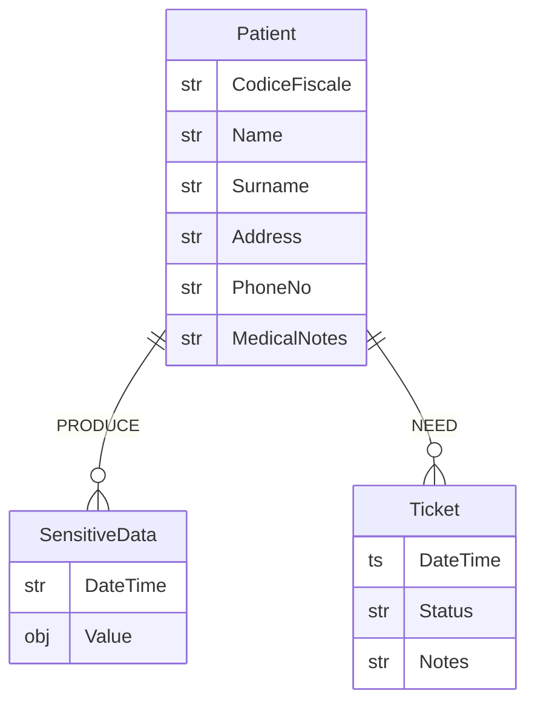
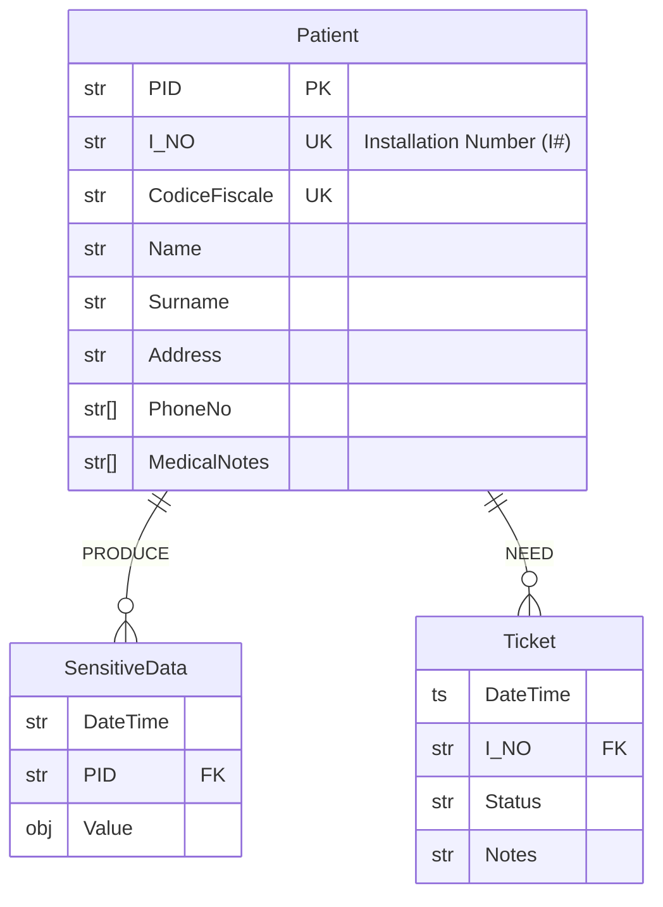
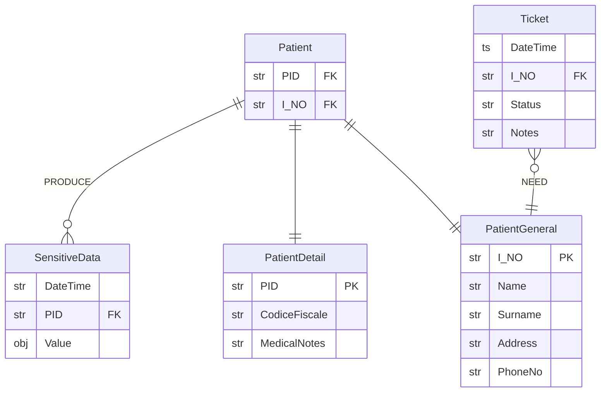
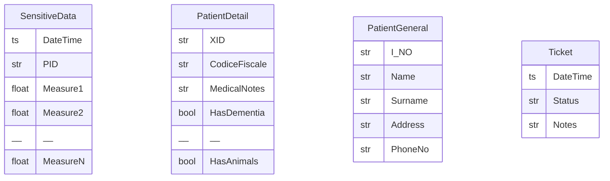
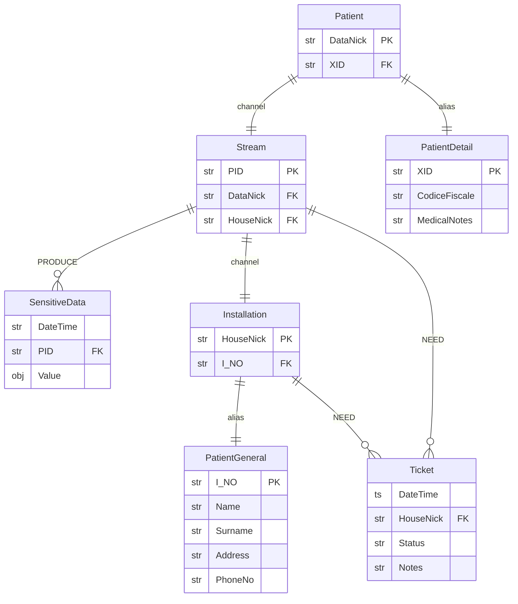

# Data Model

## Conceptual ER



## Data Identification

Let's introduce `PID` and `I_NO`, which are respectively `Patient` and `Installation` primary keys.
Then `DataNick` and `HouseNick` are human-friendly aliases respectively for `PID` and `I_NO`.
These aliases can be used in communication contexts among users who do not share the same data views but need to refer to the same objects.
Precisely, `DataNick` is used to relate to the same `Patient`, and `HouseNick` is used to relate to the same `HouseNick`.

`Nick` generation can be:

1. **Random**: in this scenario `Nick` is randomly drawn at `Patient` creation
2. **Hashing**: a *derivation function* can be designed to map primary keys to `Nick`, see [here](./hashing/)

Precisely, we intend to use **random** generation for the [V2 model](#model-v2--what-if-id-disclosure-is-an-issue), and **hashing** generation for the [V0 model](#v0-model--baseline).
From now on we omit `Nick` in the diagrams when not necessary; we'll point out when presence is instead relevant.

## `V0` Model · Baseline

### ER Diagram



Where `SensitiveData` is a generalization for `D1`, `D2`, `D3` and `D4` tables.

### ER Diagram - RBAC view



### Logic Model

```js
Patient(PID, I_NO) // Lookup Table

PatientGeneral(I_NO, Name, Surname, Address, PhoneNo)
PatientDetail(PID, CodiceFiscale, MedicalNotes)

Ticket(DateTime, I_NO, Status, Notes)

SensitiveData(DateTime, PID, Value)
```

Where `PatientDetail` and `PatientGeneral` are encrypted, and `SensitiveData` is stored in the existing InfluxDB.

## Model `V2` · What if `ID` disclosure is an issue

In the `V0` Model, `monitor`, `dottori` and `analista` share `PID` knowledge.
This doesn't properly follow the principle of separation of duty: `PID` indexes both sensitive attributes and their related quasi-identifiers.

Table encryption still mitigates reidentification risk, but in case of disclosure or leak, record information will be easy to match.
A more secure implementation should hinder joins between tables as much as possible.
This can be achieved by using different IDs among all tables.

Let's change `PID` to `XID` in `PatientDetail`, and remove the relationships between entities and the `Patient` table (that in the previous ER is used as a lookup table).



However, each user group must be able to relate to a `Patient` using a common alias even if they access different tables with different IDs.

### Aliasing

In this solution, two channels are aliased:

- `tecnico` will be able to communicate about an `Installation` with `monitor` by using the `HouseNick`, which is known to both.
- `monitor` or `analista` will be able to communicate about a `Patient` with `dottore` by using `DataNick`, which is known to both.

This solution requires to define all lookup operation:

1. `XID` ➡️ `DataNick`
2. `PID` ➡️ `DataNick`
3. `DataNick` ➡️ `XID`
4. `DataNick` ➡️ `PID`
5. `HouseNick` ➡️ `PID`
6. `HouseNick` ➡️ `XID`
7. `HouseNick` ➡️ `I_NO`
8. `PID` ➡️ `HouseNick`
9. `XID` ➡️ `HouseNick`
10. `I_NO` ➡️ `HouseNick`

Then, for each operation, it should be defined which user groups need to access it.

Implementatively, it's not needed to specify the capabilities for all lookup operations: anyone who already can decrypt a lookup table is already authorized to perform any combination of lookup operations inside the same lookup table. More details [here](../auth-ac).

### ER Logical Model



### How is this better?

In the case any table gets leaked, no user will be able to link the newly disclosed information to his view of the data.
For example, if the `PatientDetail` table is leaked, `tecnico` users won't be able to join it with `PatientGeneral` table (to which he has access), because the `XID` identifier is meaningless to them.

### Logical Model

```js
Patient(XID, DataNick)
Installation(I_NO, HouseNick)
Stream(PID, HouseNick, DataNick)

PatientGeneral(I_NO, Surname, Name, Address, PhoneNo)
PatientDetail(XID, CodiceFiscale, MedicalNotes)
SensitiveData(DateTime, PID, Value)

Ticket(DateTime, HouseNick, Status, Notes)
```

Where `Patient`, `Installation` and `Stream` are basically encrypted lookup tables, `PatientDetail` and `PatientGeneral` are also encrypted, and `SensitiveData` is stored in the existing InfluxDB.
