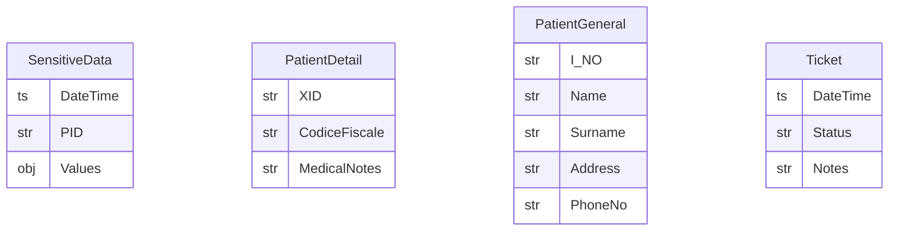

# Data Model


## Data Identification

Let's introduce `PID` and `INo`, that are respectively `Patient` and `Installation` primary keys.
Then `DataNick` and `HouseNick` are human-friendly aliases respectively for `PID` and `INo`.
These aliases can be used in communication contexts among users who do not share the same data views but need to refer to the same objects.
Precisely, `DataNick` is used to refer the same `Patient`, `HouseNick` is used to refer the same `HouseNick`.

`Nick` generation can be:

1. **Random**: in this scenario `Nick` is randomly drawn at `Patient` creation
2. **Hashing**: see [here](./hashing/)

From now one we will omit `Nick` when not necesssary, we will point out when presence is relevant.

## Baseline Model (V0)

### ER Diagram


### ER Diagram - RBAC view


### Logic Model

```js
Patient(PID, I_NO) // Lookup Table

PatientGeneral(I_NO, HouseNick, Name, Surname, Address, PhoneNo)
PatientDetail(PID, CodiceFiscale, MedicalNotes)

Ticket(DateTime, I_NO, Status, Notes)

SensitiveData(DateTime, PID, Values)
```

Where `PatientDetail` and `PatientGeneral` are encrypted, and `SensitiveData` is stored to the existing InfluxDB.

## What if `ID` disclosure is an issue

In the V0 Model, `monitor`, `dottori` and `analista` share `PID` knowledge.
This can be see as a weakness in separation of duty: basically the same `ID` is used to identify both sensible attributes and identifiers.
Table encryption will for sure mitigate reidentification risk, until tables will remain encrypted.
In case of data disclosure or leakage, a better implementation should obstruct joins between tables.

Let change `PID` to `XID` in `PatientDetail`, and remove the relationships between entities and the `Patient` table (that in the previous ER is used as a lookup table).



However now each user group has to be able to reference the same `Patient` even if they don't share the same view of the data.

### Aliasing

In this solution, two channels are aliased:

1. `dottori` <-> `monitor`/`analista` is called `DataNick`
2. `tecnico` <-> `monitor` is called `HouseNick`

This solution requires to define all lookup operation:

0. `XID` -> `DataNick`
0. `PID` -> `DataNick`
0. `DataNick` -> `XID`
0. `DataNick` -> `PID`
0. `HouseNick` -> `PID`
0. `HouseNick` -> `XID`
0. `HouseNick` -> `I_NO`
0. `PID` -> `HouseNick`
0. `XID` -> `HouseNick`
0. `I_NO` -> `HouseNick`

Then, for each operation, it shoud be defined which user groups need to access it.


## Logical Model

```js
Patient(XID, DataNick)
Installation(I_NO, HouseNick)
Stream(PID, HouseNick, DataNick)

PatientGeneral(I_NO, Surname, Name, Address, PhoneNo)
PatientDetail(XID, CodiceFiscale, MedicalNotes)
SensitiveData(DateTime, PID, Values)

Ticket(DateTime, HouseNick, Status, Notes)
```

Where `Patient`, `Installation` and `Stream` are basically encrypted lookup tables, `PatientDetail` and `PatientGeneral` are also encrypted, and `SensitiveData` is stored to the existing InfluxDB.

In an implemetation overview, it's not need to specify the capabilities for all lookup operation, anyone who already can decrypt a lookup table is authorized a priori to perform any combination of lookup operation inside the same lookup table.
