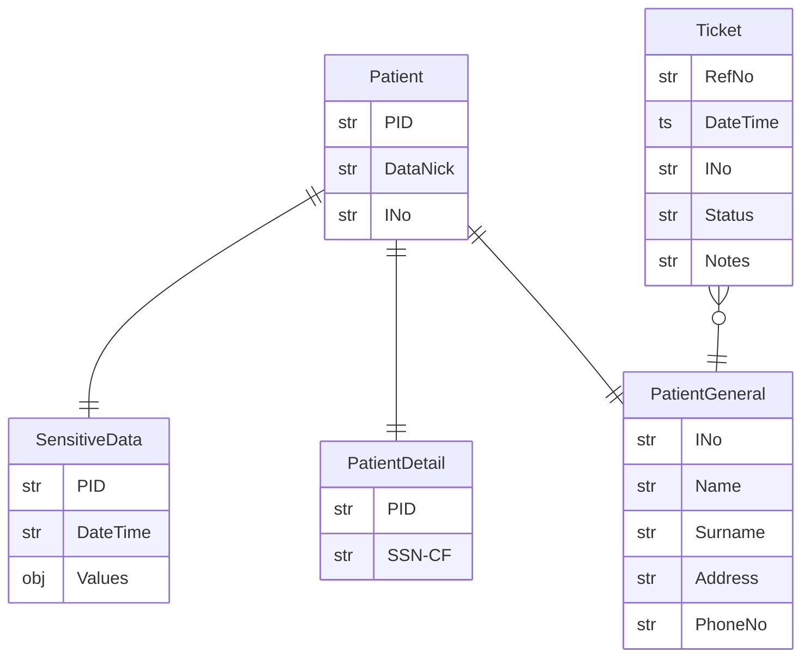

# Data Model

`PID` and `INo` are respectively `Patient` and `Installation` primary keys.

`DataNick` and `HouseNick` are human-friendly aliases respectively for `PID` and `INo`.
These aliases can be used in communication contexts among users who do not share the same data views but need to refer to the same objects.
Precisely, `DataNick` is used to refer the same `Patient`, `HouseNick` is used to refer the same `HouseNick`.
We can figure these aliases like an hashing of its PID.


## Baseline V0

### ER Diagram



### Logic Model

```java
Patient(PID, DataNick, I#)

PatientGeneral(I#, HouseNick, Name, Surname, Address, PhoneNo)
PatientDetail(PID, SSN)
SensitiveData(PID, ...)

Ticket(DateTime, I#, RefNo, Status, Notes)
```

### V1.5 - Concept of `Stream` entity

```
Patient(PID)
Installation(I#)
Stream(I#, PID)

PatientGeneral(I#, Surname, Address, PhoneNo)
PatientDetail(PID, Name, SSN, *DoB, *PoB, *Age)
SensitiveData(PID, ...)

Ticket(DateTime, I#, RefNo, Status, Notes)
```

## V2 - Refactoring

```
Patient(PID, DataNick)
Installation(I#, HouseNick)
Stream(SID, HouseNick, DataNick)

PatientGeneral(I#, Surname, Address, PhoneNo)
PatientDetail(PID, Name, SSN, *DoB, *PoB, *Age)
SensitiveData(SID, ...)

Ticket(DateTime, HouseNick, RefNo, Status, Notes)
```

**Advantages of V2 model:**
It's not neede to specify the capabilities for all lookup combinations, anyone who already has `Key` to decrypt lookup tables is authorized a priori to perform any lookup combination on the same table.
