# 🎻 Serenade Docs

## Actors

Let's describe user groups:

- `HOS` represents doctors or any personnel related to the hospital that organizes the recruitment of patients.
- `IIT` represents technicians who install and maintain patient equipment.
- `IMT` represents system admins who monitor the whole infrastructure.
- `UniMi` represents analysts and computer scientists employed at the University of Milan.

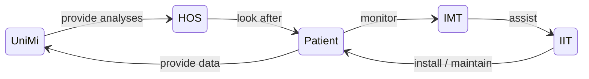

## Architecture

Let's describe the modules, and their features, developed in this project:

- **FrontEnd** is a web app where:
  - `HOS` can list patients, add new ones, and visualize their analyses.
  - `IIT` and `IMT` can record their progress regarding patient equipment and any related issues.
- **BackEnd** is a middleware API that will manage user authentication and data access control.
- **DataBase** is a data storage for FrontEnd module, that will also provide an encryption layer for sensitive data.
- **KeyCloak** is a web app where user capabilities and signup can be managed.

In this image, we can visualize broadly  interactions between each actor or entity:
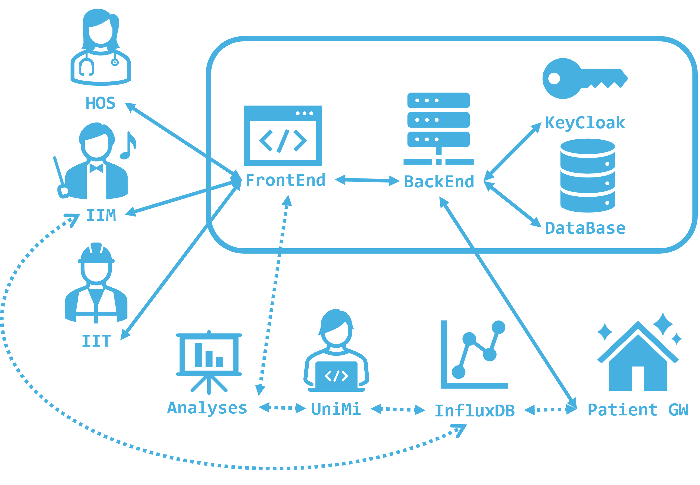

- Bold arrows represent interactions that have been modeled in this context. Modules related to this context are highlighted by the rounded rectangle.
- Dotted arrows represent interactions that are already deployed or have been planned to be deployed out of this context.

We'll see later in detail each interaction in [Data Flow](#data-flow) section, now we'll describe how data have been modeled.

## Data Model

### Conceptual ER

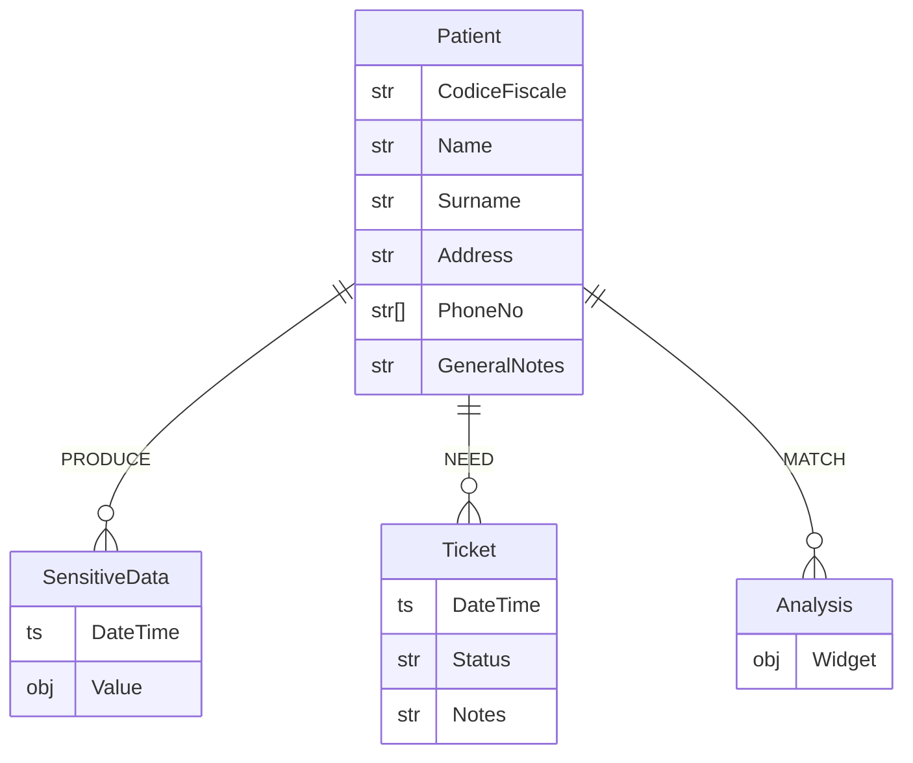

- `Patient` represents data associated with a patient.
- `SensitiveData` represents sensitive data produced by equipment installed at the patient's house.
- `Ticket` represents messages between `IIM` and `ITM` during an intervention ticket.
- `Analysis` represents the results of analyses carried out by `UniMi` over `SensitiveData`.

### Data Identification

Let's introduce `PID` and `I_NO`, which are respectively primary keys of `Patient` and `Installation` abstract entities.
So we denote `DataNick` and `HouseNick` as human-friendly aliases respectively for `PID` and `I_NO`.
These aliases can be used in communication contexts among users who do not share the same data views but need to refer to the same objects.
Precisely, `DataNick` is used to relate to the same `Patient`, and `HouseNick` is used to relate to the same `HouseNick`.

`Nick` generation can be:

1. **Random**: in this scenario `Nick` is randomly drawn at `Patient` creation
2. **Hashing**: a *derivation function* can be designed to map primary keys to `Nick`

We intend to use **hashing** generation. From now on we omit `Nick` in the diagrams when not necessary; we'll point out when presence is instead relevant.

In **hashing** scenario we don't need anymore to store any `Nick` in the data model, `Nick` can be derived locally.

We can figure `Nick` aliases like hashing of their primary keys. Then an `S_Table` will bind hashing to representation. Let's see a toy example of hashing. Imagine a simple `S_Table` like this:

| Byte | Word |
|---|---|
| 00 | Black |
| 01 | Blue |
| 10 | Red |
| 11 | Magenta |

The `Nick` derivation will follow this flow:

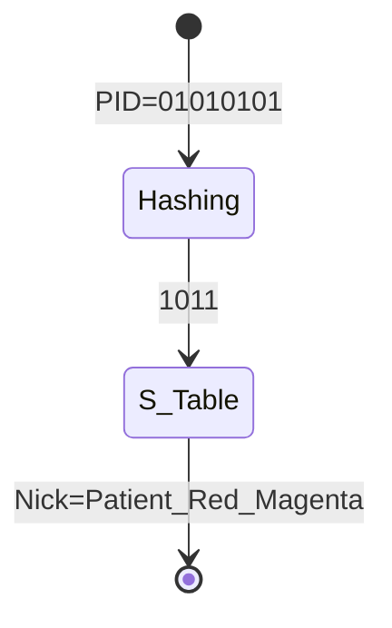

### ER Diagram

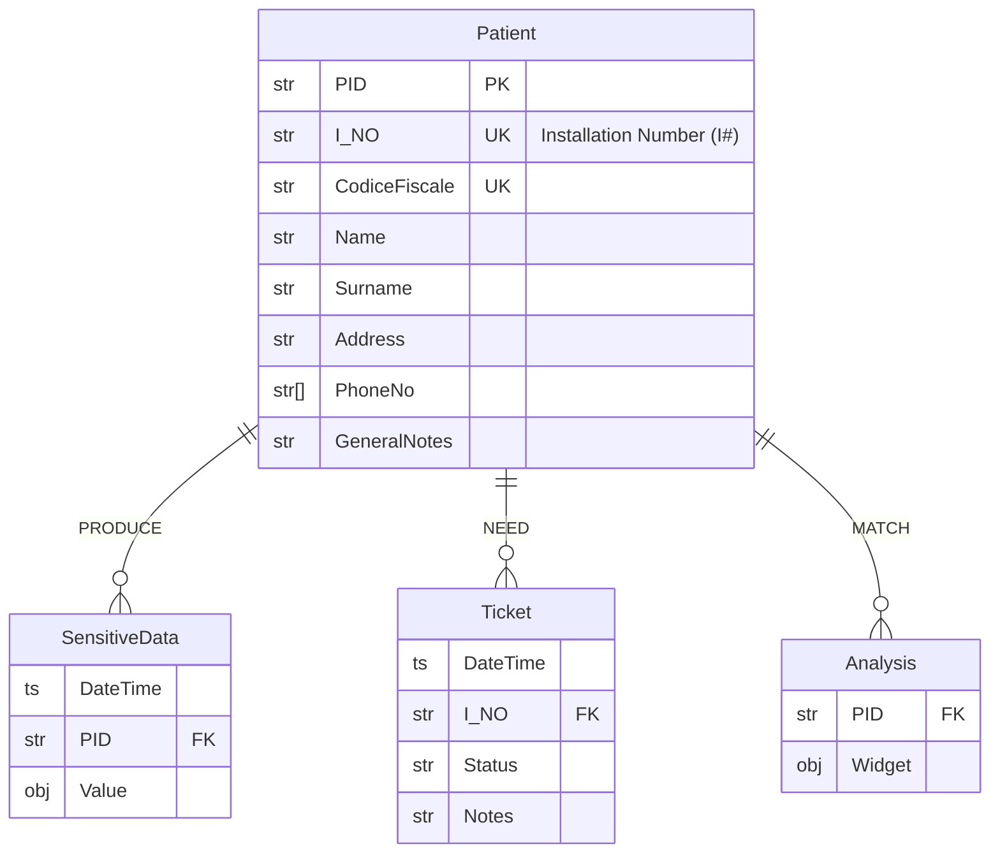

Where `SensitiveData` is a generalization for `D1`, `D2`, `D3` and `D4` tables.

### ER Diagram - RBAC view

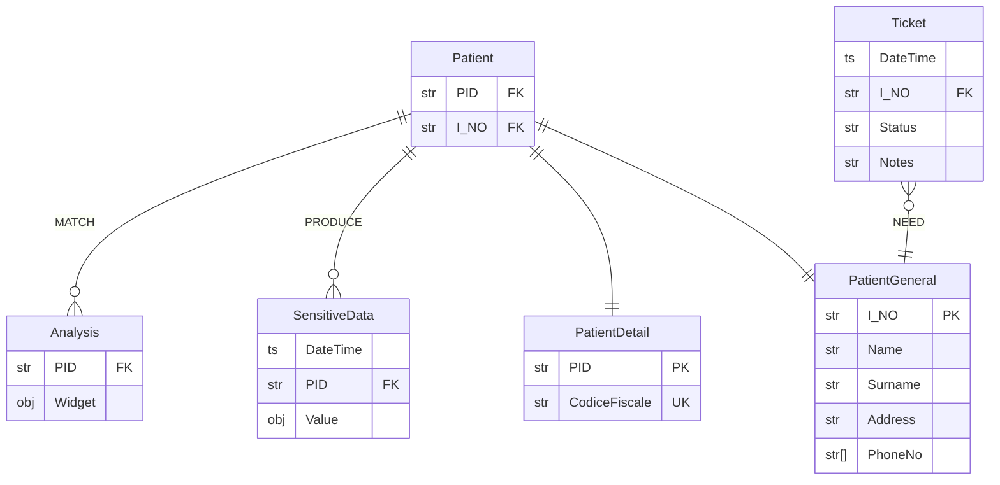

### Logic Model

```js
Patient(PID, I_NO) // Lookup Table

PatientGeneral(I_NO, Name, Surname, Address, PhoneNo)
PatientDetail(PID, CodiceFiscale)

Ticket(DateTime, I_NO, Status, Notes)

SensitiveData(DateTime, PID, Value)

Analysis(PID, Widget)
```

Where `Patient`, `PatientDetail` and `PatientGeneral` are encrypted.

 `SensitiveData` refers to the existing InfluxDB. In general, any table can be stored on different DBs, APIs will take care of referential integrity constraints.

## Table Access Control

In the following table, we specify for each user group which table can be accessed.

| | HOS | IMT | IIT | UniMi |
| - | - | - | - | - |
| Patient | ✅ | ✅ | ❌ | ❌ |
| PatientGeneral | ✅ | ❌ | ✅ | ❌ |
| PatientDetail  | ✅ | ❌ | ❌ | ❌ |
| Ticket | ❌ | ✅ | ✅ | ❌ |
| SensitiveData  | ❌ | ✅ | ❌ | ✅ |
| Analysis  | ✅ | ❌ | ❌ | ✅ |

Where:

- ✅ is granted
- ❌ is not granted

## Data Encryption

DBMS, like MariaDB, supports fine-grained access control at the table level through the use of roles and permissions.
You can assign specific privileges to those roles for particular tables.
This allows you to control who performs certain actions on specific tables and log them.

Then the dataset can be encrypted using **TDE** (Transparent Data Encryption) on the server side.
TDE encrypts data files at rest, it operates at the file level, encrypting the entire database, data files, and transaction log files.

The data encryption process is transparent to applications and users accessing the database.
As data is written to disk, it is encrypted using symmetric encryption algorithms such as **AES** (Advanced Encryption Standard).

When data needs to be read from disk, the encrypted data is decrypted on the fly.
Again, this decryption process is transparent to applications and users, so the database engine handles the decryption automatically as data is accessed.

## Authentication

Users can register or manage their accounts from `keycloack.domain/realms/serenade/account/`.

### Signup without IdP

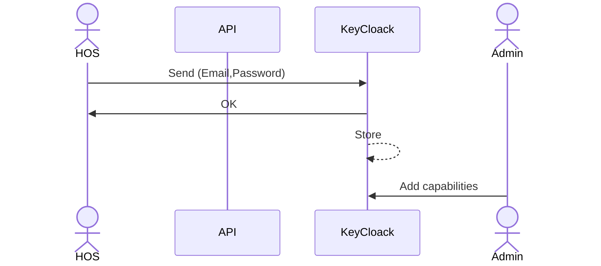

### Signup with IdP

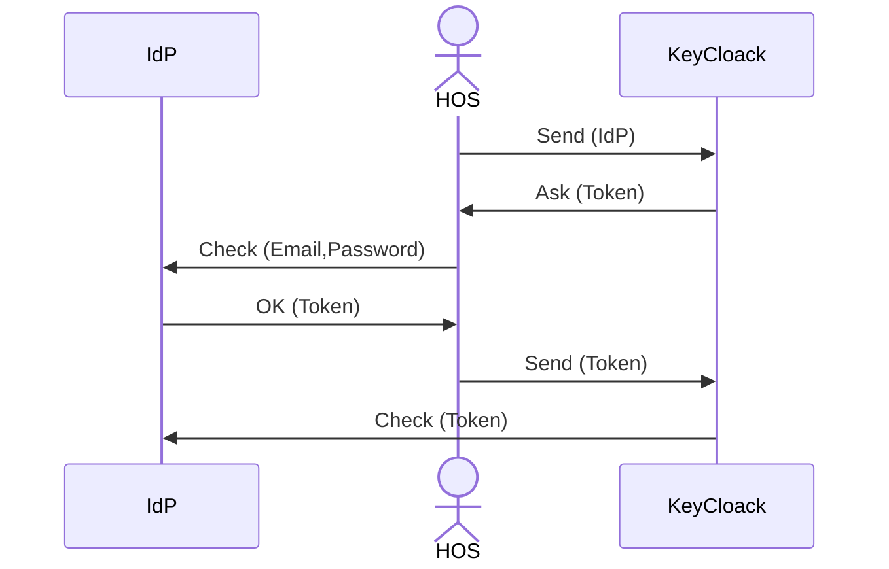

## Authorization

Any action over the `Database` must be granted by `Keycloak`.
We can generalize all actions like the following sequence diagram:

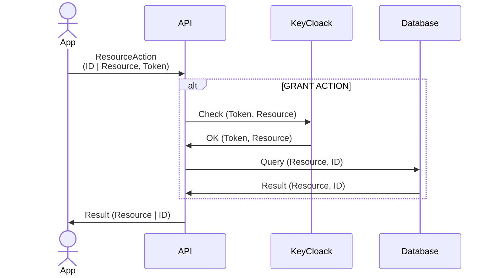

Where `ResourceAction` can be:

- A `Lookup` query on an `ID` or `Nick`
- `Get` an existing `Patient` or `Ticket`
- `Post` a new `Patient` or `Ticket`
- `Pull` an update for a `Patient` or a `Ticket`

## Data Flow

Let's take a general overview of the flows. Here below we visualize broadly the flow of ***initialization*** and ***installation*** protocol:

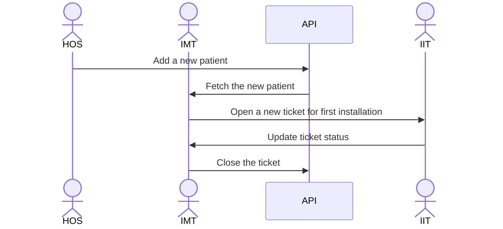

Here instead we visualize broadly the data flow meanwhile ***anonymization*** and ***deanonymization*** protocol is applied:

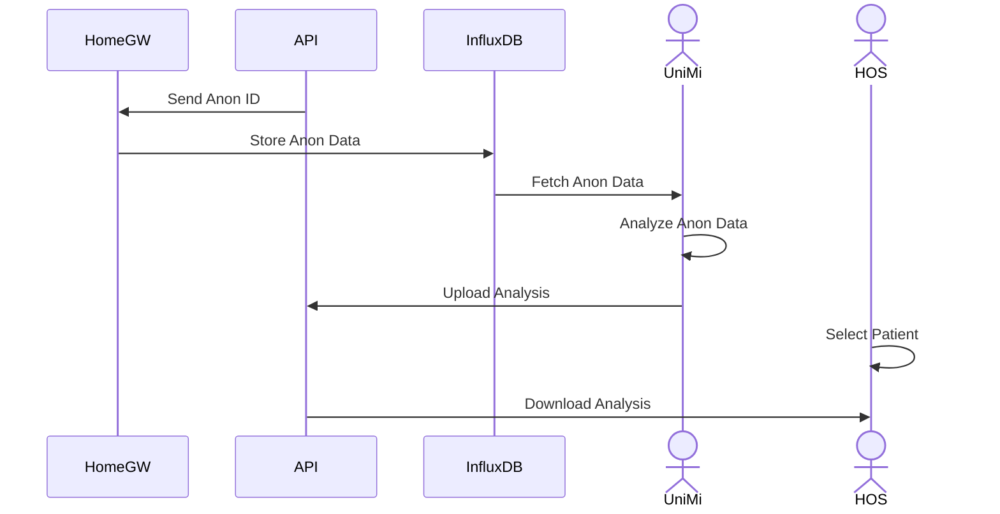

Now we'll see in deep each protocol.

### Initialization

The ***initialization*** protocol focuses on how a new patient is added.

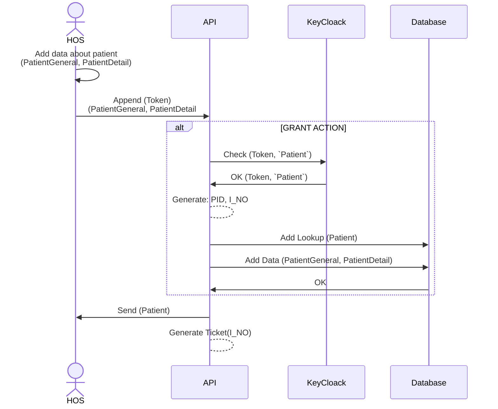

A doctor will upload `Patient` data through the FrontEnd, and a `Token` is required to upload data. The `Token` can be obtained through the authentication phase described earlier.

For this protocol, the grant action will follow some different steps as described earlier: `Token` capabilities will be checked for `Patient` table, and then `API` will generate randomly two IDs, `I_NO` for `PatientGeneral` and `PID` for `PatientDetail`. Finally, the two records will be uploaded, and an acknowledgment will be sent to the doctor.

An installation `Ticket` is automatically generated, it will help `IMT` and `IIT` to track down the next steps.

### Installation or Intervention

This protocol behaves in similar manners both for ***installation*** and ***intervention*** protocols.

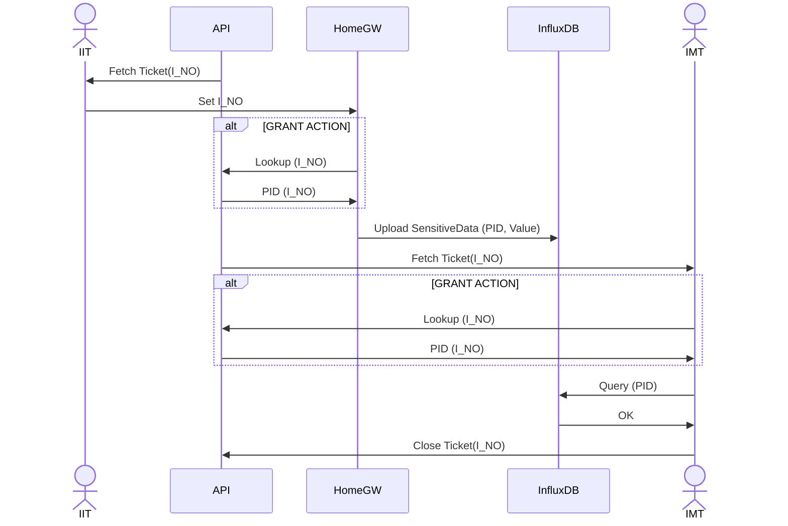

When a `Ticket` is available both `IMT` and `IIT` will be notified.

`IMT` can set a default set of credentials into `HomeGW` equipment before the installation phase. Then `IIT` will collect `HomeGW` equipment and install it at the patient's house. Finally, `IIT` will set `I_NO` into the equipment (like a environment variable or anything similar).

It's also possible for `IMT` to pre-set on `HomeGW` equipment the `PID` instead of a set of default credentials, but the equipment should be customized for each patient before installation.
Letting the `IIT` set `I_NO` during installation will make it possible to interchange equipment without regard to who's gonna use it.

Thus `HomeGW` will send `SensitiveData` to `InfluxDB` using the pseudo-anon `PID`.
As mentioned before, `PID` can be pre-set by `IMT` or obtained by the `HomeGW` through an `API` lookup action.

`IMT` will verify that the data are uploading correctly and close the related `Ticket`.
The `Ticket` can be reopened in case any issue occurs. `IMT` and `IIT` will be able to review the history of previous interventions.

### Anonymization

We indirectly saw this protocol inside ***installation*** and ***intervention*** protocols.

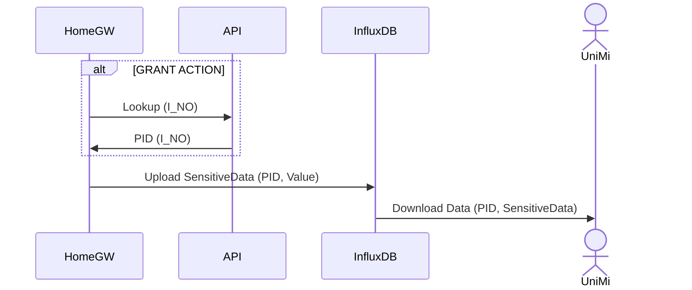

The ***anonymization*** protocol is nothing but using an anonymous pseudo-identifier for data related to a sensitive recipient.

This will be possible thanks to the lookup action between `I_NO` and `PID`. Lookup capabilities have been described [here](#table-access-control).

### Deanonymization

The ***deanonymization*** protocol specifies how data can be rejoind and let `HOS` obtain the full information set for a patient.

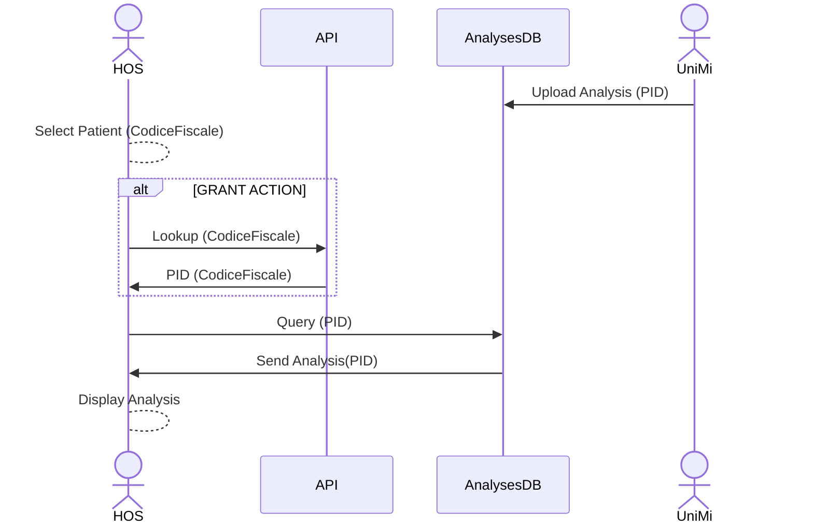

After `UniMi` has carried out analyses on data, it will store results on a database or any data storage consistent with the format of analysis results.

The `HOS` will select a patient, and obtain its `PID` through a lookup action over `CodiceFiscale`.
Then the `PID` can be used to fetch analyses from the `AnalysesDB` and finally visualize them.

**A simple implementation**: analyses could be formatted and stored as static web resources, so analyses fetching will be a web request, and results will be rendered on the front-end side on a web view. This implementation will keep `FrontEnd` independent from the analysis format and make rendering easier.
